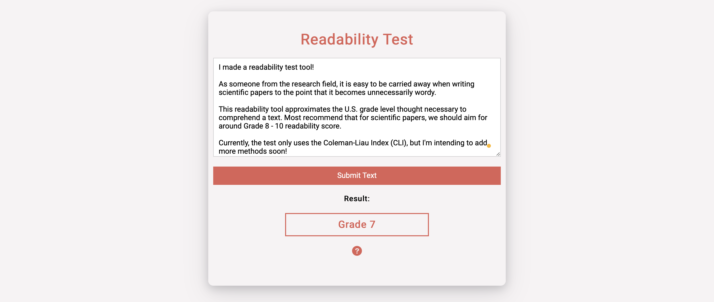

# Redability Test for Researchers 

Use this [minimal readability tool](https://imarijoyborda.com/readability/) to see and check that your text is not too verbose. Supports unlimited text length. Designed for researchers and writers who have long texts. 

Link to project:[https://imarijoyborda.com/readability/](https://imarijoyborda.com/readability/). 

## How To Use
Enter the text in the text box. Click  `Submit Text` to see the result. 

The test uses the Coleman–Liau index (CLI) to calculate the grade level. The result approximates the U.S. grade level thought necessary to comprehend the text. The lowest grade level is `Before Grade 1` while the highest is `Grade 16+`. The lower the grade level is, the easier the text can be comprehended.

## How It's Made
Tech used: HTML, CSS, and JavaScript.

## Future Improvements
There are still lots that need to be improved in this web application. Some plans are:
* Add support for other readability test.
* Allow upload of texts. 

Contributions are also very welcome! Just issue a pull request.